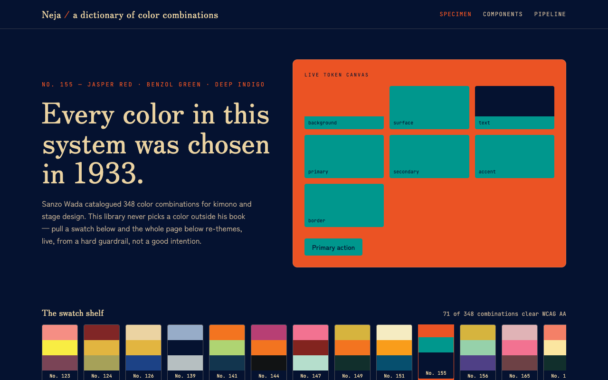
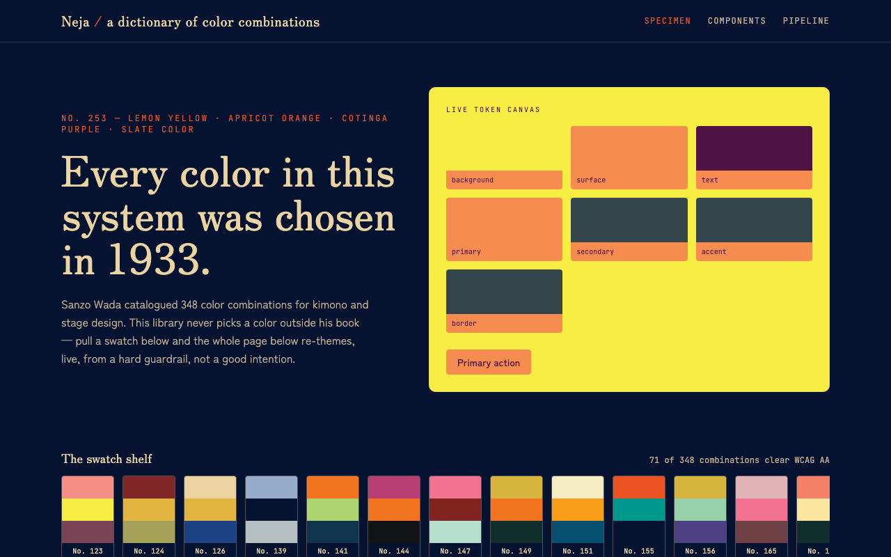
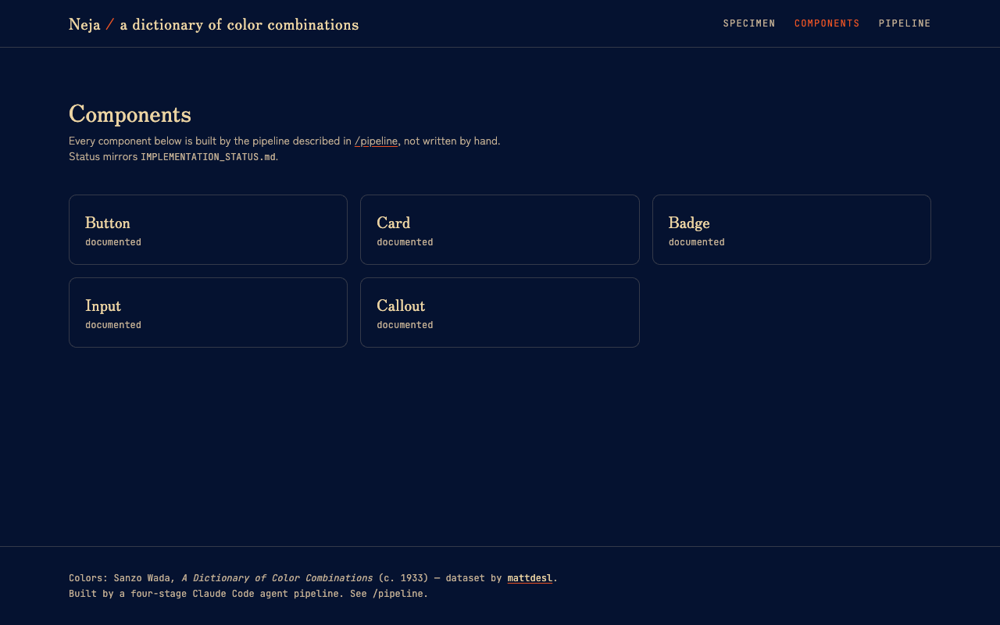
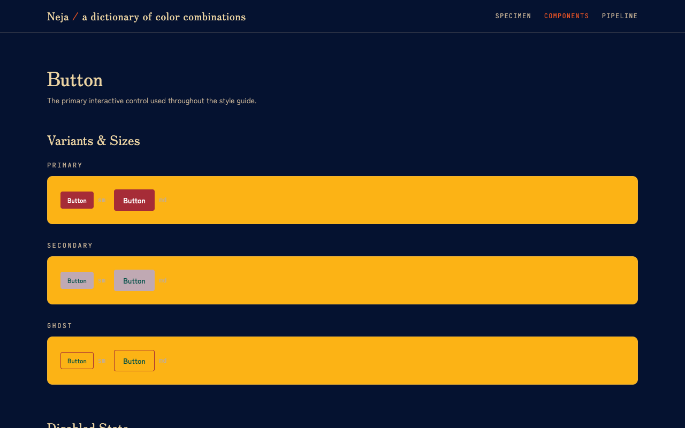
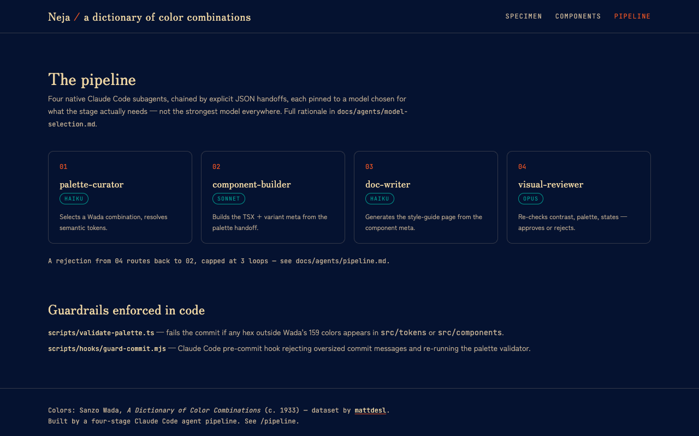

# Neja — A Dictionary of Color Combinations

A design system with a rule: **no color is invented.** Every hex value in this codebase traces back to one of the 159 named colors in Sanzo Wada's 1933 *A Dictionary of Color Combinations* — and a script, not a convention, enforces it.

It's also the vehicle for something else: a working demo of a native Claude Code multi-agent harness. Every component here was built by a four-stage agent pipeline — different models per stage, structured JSON handoffs instead of prose, and a hard guardrail no agent (or human) can quietly route around.



## The constraint

[Sanzo Wada](https://en.wikipedia.org/wiki/Wada_Sanzō) was a Japanese painter and costume designer who spent years cataloguing color harmony for kimono and stage design. The result — *A Dictionary of Color Combinations* — is 348 numbered palettes, 159 unique named colors, each combination already harmonized by a professional colorist decades before "design tokens" existed.

This repo vendors that dataset ([`mattdesl/dictionary-of-colour-combinations`](https://github.com/mattdesl/dictionary-of-colour-combinations), MIT) and never lets a hex value escape it. Pull a swatch on the shelf and every token — background, surface, text, primary, secondary, accent, border — is remapped live from that combination's actual colors. No gradients, no tints, no "close enough." One click swaps the hero above from **No. 155** (Jasper Red · Benzol Green · Deep Indigo) to something like this:



## The guardrail

A prompt instruction is advice. A script is a gate.

```bash
npm run validate:palette
```

`scripts/validate-palette.ts` scans `src/tokens/**` and `src/components/**` for any `#rrggbb` literal and fails the build if it isn't one of Wada's 159 colors. It's wired as a Claude Code pre-commit hook (`.claude/settings.json` → `scripts/hooks/guard-commit.mjs`), so a careless agent — or a careless human with a color picker — gets blocked before the commit lands, not caught in review.

```text
✗ Palette guardrail failed — 1 hex value(s) outside the Wada dictionary:

  src/components/Button.tsx:73  #123456

Every color must come from one of Wada's 159 named colors.
```

## The components

Five components, each with a live variant matrix, a props table, and a **Preview / Code** panel — pick a variant, hit "Copy to clipboard," paste it straight into your own project.





## The harness

```text
palette-curator  →  component-builder  →  doc-writer  →  visual-reviewer
    (haiku)             (sonnet)           (haiku)            (opus)
```

Four subagents, each scoped to one job, chained by strict JSON handoffs instead of free text — so the next stage parses structured data, not a paragraph. The model per stage is a deliberate choice, not a default: mechanical lookup work runs cheap and fast, architecture-sensitive code gets more headroom, and the final approve/reject gate — where a false positive is the worst failure mode in the pipeline — runs on the strongest model available.



Full writeup of *why* each model was picked, the exact handoff schema, and what's enforced in code vs. asked for in a prompt: see [`AGENTS.md`](AGENTS.md) and [`docs/agents/`](docs/agents/).

This pipeline is not a slide — it actually built every component in this repo, rejection loops included. `IMPLEMENTATION_STATUS.md` is the audit trail.

## Running it

```bash
npm install
npm run dev             # dev server
npm run build            # production build
npm run typecheck        # tsc --noEmit
npm run validate:palette # the guardrail, standalone
```

## Stack

Vite · React · TypeScript · Tailwind CSS v4 · `class-variance-authority` · CSS custom properties for the token layer, so re-theming is a runtime variable swap, not a rebuild.

## Credits

- Color data: Sanzo Wada, *A Dictionary of Color Combinations* (c. 1933)
- Dataset: [`mattdesl/dictionary-of-colour-combinations`](https://github.com/mattdesl/dictionary-of-colour-combinations) (MIT)
- Typefaces: Zen Old Mincho, Zen Kaku Gothic New, JetBrains Mono
